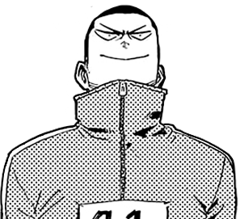

<h1 align="center"> <i><b>yoarajota</b></i></h1>

<h2 align="center">    </h2>

 
 

                                                           
<h2></h2>
<h2></h2>
 

  
 

  <b>currently learning 👉</b>
  <i> html, css, javascript, flutter, dart </i>
 

<b>university;</b><i> -//-, 0% <i>
 

